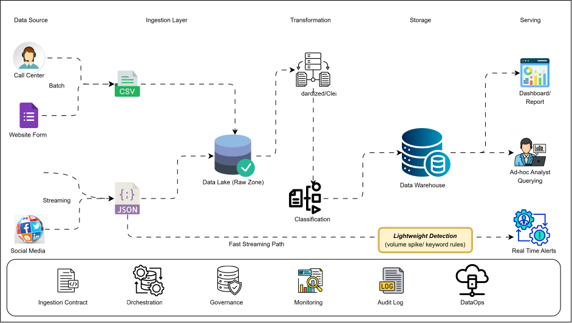

# Beejan Technologies: Conceptual Complaints Data Pipeline

## Introduction

Beejan Technologies is a telecom company that serves a large base of customers across
multiple regions. Every day, thousands of those customers raise complaints about issues
such as poor network coverage, incorrect billing, and unsatisfactory customer service.
These complaints do not arrive in one place or one shape. They come in through social
media, call centre log files, SMS, and website forms, each in its own format and at its
own pace.

This repository contains a **conceptual, end-to-end design** for a data pipeline that would
bring all of those complaints together, clean them, classify them, and make them ready for
reporting and analysis. It is a blueprint, not an implementation: the goal at this stage is
to settle the concepts and the flow of data, so that the actual pipeline can later be built
on a clear foundation. In keeping with the brief, no specific technologies or products are
named. Each stage is described by what it would do and why.

## Problem Statement

Today, complaint data at Beejan is fragmented. It is stored in different formats across
different channels, and no single pipeline exists to bring it together. The reporting team
compiles spreadsheets by hand, reports are delayed, and teams work in silos. The result is
that the business cannot answer simple questions with confidence, such as how many
complaints came in, of what kind, and from where, let alone act on them quickly.

The volume itself is not the core difficulty; a few thousand complaints a day is modest.
The real difficulty is **fragmentation**: the same kind of complaint arrives in four
different shapes through four different doors, and no one can count it once. The design that
follows is aimed squarely at that problem: turning four channels into a single, trusted
complaint record that everyone reads the same way.

## Architecture Diagram

_Figure: Conceptual end-to-end complaints data pipeline._

---

### 1. Design Choices

The design follows the flow of a single complaint from the moment it is raised to the point
where it produces insight, guided by the seven areas in the brief.

**Source identification.** There would be four data sources: social media, call centre log
files, SMS, and website forms. They differ in both format and frequency. SMS and social
media would arrive continuously and be treated as **streaming** sources; call centre logs
and website form submissions would arrive as files and records that can be collected on a
schedule, and would be treated as **batch**. This mix of batch and streaming is deliberate,
so each source is handled in the way that suits how it actually arrives.

**Ingestion strategy.** Streaming sources would be ingested as a continuous flow of events, while batch sources would be pulled on a schedule. At the point of ingestion, no business logic would be applied. Each record would simply be captured and stamped with its source, the time it occurred, the time it was received, and a unique identifier. This keeps ingestion simple and reliable, and means every record can later be traced or replayed. Real-time channels such as social media would sit on the streaming path so that nothing time-sensitive has to wait for a batch window, and would still pass through the same processing steps as every other source.

**Raw storage.** All incoming data would land first in a **data lake**, stored exactly as it
arrived and never edited. This raw copy is inexpensive to keep and serves two purposes: if a
rule changes later, history can be reprocessed rather than only applied going forward; and
any figure in a report can be traced back to the original message.

**Processing and transformation.** Transformation would happen in two ordered steps.
First, **Standardize/Clean** would parse each channel's format into one common complaint
schema, normalise fields such as dates and phone numbers, and remove duplicates within and
across channels. Then, **Classification** would sort each cleaned complaint into a category such as
network, billing, or customer service, along with a sub-type, sentiment, and
severity. The order matters: classification would run on already-cleaned data, because clean,
standardised text is far easier to categorise reliably. Simple rules would handle the obvious
cases, and a text-classification approach would handle the rest; anything low-confidence would
be set aside for human review, and those reviewed decisions would feed back to improve the
classifier over time.

**Storage options.** The design would use both a lake and a warehouse, at two layers. The
**data lake** holds the raw, mixed-format data as it lands. Once data has been standardised
and classified, it becomes structured, with one row per complaint and the original message kept
in a text field, and would be written into a **data warehouse** that serves reporting and
analysis. Because nothing unstructured needs to be carried forward, a warehouse (rather than a
combined store) is the appropriate home for the curated data. The cleaned data would be stored
in an efficient columnar format and partitioned by date and region, since most questions read a
few fields across many rows.

**Serving**. Three kinds of consumer would read from the curated layer: **dashboards and reports** for management to see volumes, categories, and trends; **ad-hoc querying** for analysts to explore the data directly; and **real-time alerts** for urgent situations such as a sudden spike tied to a network outage. The alerts would be fed by a **fast streaming path** that branches off ingestion, so time-sensitive signals reach the alerting layer in minutes rather than waiting behind batch storage and transformation. On that fast path, a lightweight detection step (using simple volume-spike and keyword rules) would decide what is worth alerting on, while full classification continues on the main branch.

**Orchestration and monitoring.** Orchestration would schedule and sequence the batch work and
handle retries and backfills, while the streaming paths run continuously. Monitoring would
watch data freshness, unusual volumes, schema changes, and failed quality checks, and would
notify a named owner when something breaks. A pipeline that fails quietly is worse than one
that fails loudly.

**DataOps.** Governance, an ingestion contract, an audit log, and DataOps practices would run
across every stage rather than as a final step. This covers separate development, test, and
production environments, version control for the pipeline logic, controlled promotion to
production, access control with masking of personal data, and documentation so consumers can
find and trust what exists.

### 2. Assumptions / Thought Process

- Volume would be in the order of tens of thousands of complaints per day, with spikes during
  network incidents. This is comfortably within the reach of a single, well-designed pipeline,
  so the design has not been over-engineered for scale.
- "Real-time" is taken to mean **minutes, not milliseconds**. Streaming exists so that spikes
  and urgent cases surface quickly; dashboards refreshing on the order of an hour would be
  acceptable.
- Basic context such as the customer's region is assumed to be captured **at the point of
  complaint** (for example, from the form, the SMS, or the account raising it), so a separate
  enrichment/lookup step is treated as out of scope for this version. This is why the
  transformation stage is limited to standardisation and classification.
- Complaint text would be informal and multilingual, so the classification approach must
  tolerate abbreviations, misspellings, and mixed languages rather than assume clean prose.
- No labelled history is assumed to exist, so the first version would rely on rules plus a
  small manually labelled sample, with the human-review queue building the training set over
  time.
- Complaint records contain personal data, so masking, access control, and a retention period
  are treated as requirements from the outset, not later additions.
- Existing ticketing systems would remain the source of truth for resolving individual
  complaints; this pipeline is the analytics and prioritisation layer on top, not a replacement
  for customer-service tools.

### 3. Challenges / Unknowns

- **The same person complaining more than once.** A single customer hit by an outage might post,
  text, and call about the same issue. Counting that as several complaints would overstate the
  problem; recognising and de-duplicating it is genuinely difficult and would need tuning.
- **Classification accuracy early on.** Before enough labelled data accumulates, accuracy is the
  largest unknown. The human-review queue protects against acting on bad labels, but it carries
  an operational cost that would need to be sized with the care team.
- **Sources that change over time.** Social media interfaces change and impose limits, and call
  centre log formats tend to drift when underlying systems are updated. Detecting and handling
  these changes is expected, which is why schema-change monitoring is built in.
- **Telling genuine complaints from noise.** On social media especially, sarcasm, commentary,
  and spam can look like complaints. There is no clean solution to this, and it would need
  iteration.
- **Late or out-of-order data.** Batch files can arrive late and streams can replay, so summary
  figures must be safe to restate rather than assumed final once written.
- **Ownership of definitions.** The hardest question is organisational rather than technical: who
  decides what counts as a "billing" complaint, and who is accountable when a figure looks wrong.
  Without a clear owner for the complaint record, the silos would reassemble around the new
  pipeline.
- **Open questions for later.** The required data-retention period, acceptable end-to-end
  latency, the expected number of concurrent users, budget, and whether call recordings (as
  opposed to text logs) are in scope would all shape the eventual build.
